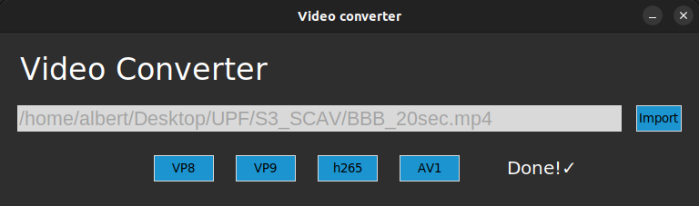

# S2_SCAV
This is a GitHub repository that has been created to upload the results of SCAV S3.

## Task 1 (Create the videos encoded with VP8, Vp9, h265 and AV1 codecs)
This task has no script associated but we can see the results in the files (we use 480p BBB video of 20 seconds):

· output_480_VP8.webm
· output_480_VP9.webm
· output_480_h265.mp4
· output_480_av1.mkv

## Task 2 (ex1.py)
This script is able to create a video with the 4 encoded videos in mosaic form.
The interesting thing about this exercise is that we have to analayze the resulting bitrate of the video, but, the resulting video has its own bitrate because it is a different video encoded using h264 and, therefore, we can not infer in the resulting bitrate as a mix of the other bitrates present from the 4 previously encoded videos. 

Another aspect that we can analyze about the resulting video is the quality/processing results of the different codecs. If we force a little bit our vision, we can actually see how av1 is not getting good color results compared with VP8 and VP9. This may come from processing issues inside the encoding process.

We can also see that from VP8 to AV1 in the order of the obtained videos, the time that we need to encode with the 4 different codecs increases, this may also come from internal processes that are runned inside the different codecs.

## Task 3 (ex2.py)
This script is able to create an interactive Tkinter interface in which users can convert their videos to the desired codecs (VP8, VP9, h265 and AV1).

| Video Converter Interface
